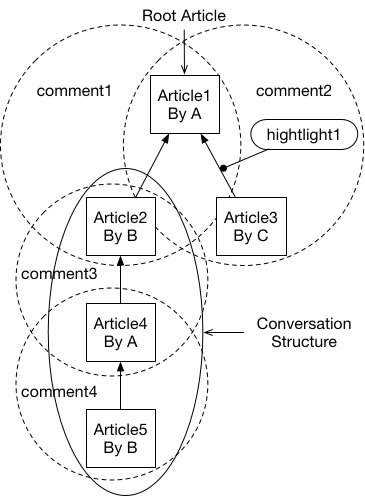

# Medium Crawler 🐜
This crawler has built up the following dataset based on Medium.com with ground truth sentence and review correspondence.

#### Dataset Statistics

You may contact Charlie Wu at jw7jb@virginia.edu to obtain the dataset

Crawler environment requirement
- python 3.6
- postgresql environment on MacOS/Linux

Define constant.py, Download chromedriver for your environment [here](https://github.com/SeleniumHQ/selenium/wiki/ChromeDriver) to project directory

To query data:
```
psql medium
\dt
select $field from $table where [conditions];
# select numLikes of highlights whose article is published before 2017 Dec 1.
SELECT (highlight.numLikes, article.postTime) from highlight LEFT JOIN article ON highlight.corrArticleID = article.articleID WHERE (article.postTime <= timestamp '2017-12-01 00:00:00' AND highlight.numLikes >= 0);
# select all paragraphs of an article
SELECT * from stn where corrArticleID = $articleID
# select number of comments associating with highlights
SELECT count(*) from comment where corrHighlightID = $highlightID
# select hightlight where number of comments associating with highlights is more than one
SELECT * from highlight where (SELECT count(*) from comment where corrHighlightID = highlightID) > 1 limit 1;

```

Datebase Table Structure:

- article

| Field   | Type      |    Info                |
| :-------------:|:-------------:| :----------------------|
| articleID           | SERIAL PRIMARY KEY |                        |
| mediumID     | varchar(300)      |                        |
| title        | text      |                        |
| recommends       | int      |                        |
| tags             | varchar(300)     |  list of tags        |
| postTime         |  timestamp        |                        |
| numLikes         |   int           |                        |
| corrAuthorID     | int      |    link to author |

- author

| Field   | Type      | Info  |
| :-------------:|:-------------:| :---- |
| authorID      | SERIAL PRIMARY KEY |  |
| name    | varchar(50)       |    |
| mediumID| varchar(20)       |     |
| username| varchar(50)       |     |
| bio     | text               |     |

- topic

| Field   | Type      | Info  |
| :-------------:|:-------------:| :---- |
| topicID      | SERIAL PRIMARY KEY |  |
| name    | text       |    |
| mediumID| varchar(20)       |     |
| description   | text               |     |

- paragraph

| Field   | Type      | Info  |
| :-------------:|:-------------:| :---- |
| paragraphID         |SERIAL PRIMARY KEY |  |
| mediumID      |varchar(10)       |    |
| content       |text               |     |
| corrArticleID     | int           |   link to article  |
| prevParagraphID     | int           |   link to paragraph  |

position in article ordered by its prevParagraphID, first paragraph has its prevParagraphID = -1

- sentence

| Field   | Type      | Info  |
| :-------------:|:-------------:| :---- |
| sentenceID         |SERIAL PRIMARY KEY |  |
| paragraphID      | int       |  link to paragraph  |
| content       |text               |     |
| corrArticleID     | int           |   link to article  |
| prevSentenceID     | int           |   link to sentence  |

osition in paragraph ordered by its prevSentenceID, first sentence has its prevSentenceID = -1

- highlight

| Field   | Type      | Info  |
| :-------------:|:-------------:| :---- |
| highlightID         |SERIAL PRIMARY KEY |  |
| content       |text               |     |
| numLikes      |int               |     |
| startOffset | int | |
| endOffset | int | |
| corrParagraphID | int |  link to paragraph |
| corrArticleID | int     |  link to article |


- comment

| Field   | Type      |  Info                    |
| :-------------:|:-------------:| :------------------------|
| commentID     | SERIAL PRIMARY KEY |                          |
| selfArticleID     | int      |  link to article   |
| corrArticleID     | int      |  link to article   |
| corrHighlightID   | int      |  link to highlight|

The detailed info of a comment is stored inside an article model as field **selfArticleID**, so it features a tree node structure:




Disclaimer: The development is for academic use only. The developer shall not be responsible for any consequence from the user behavior of this program.
For the use of dataset, acknowledgement would be appreciated.
